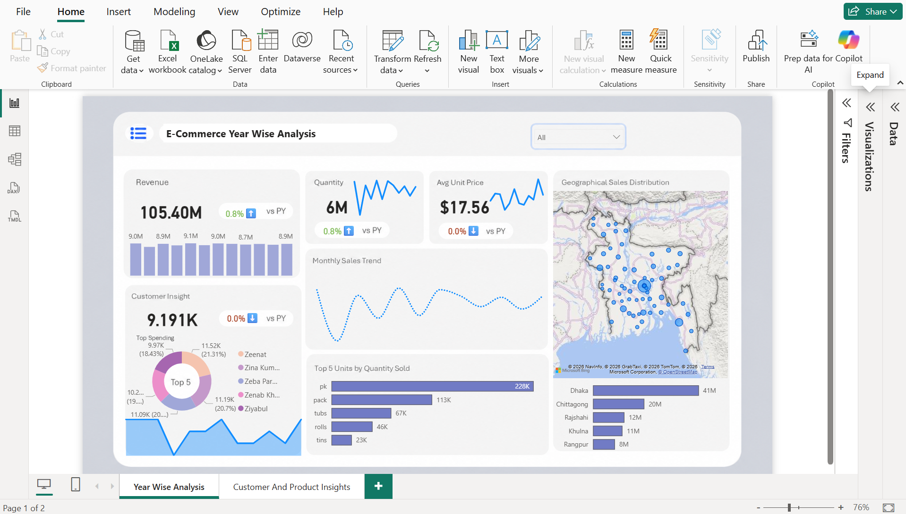
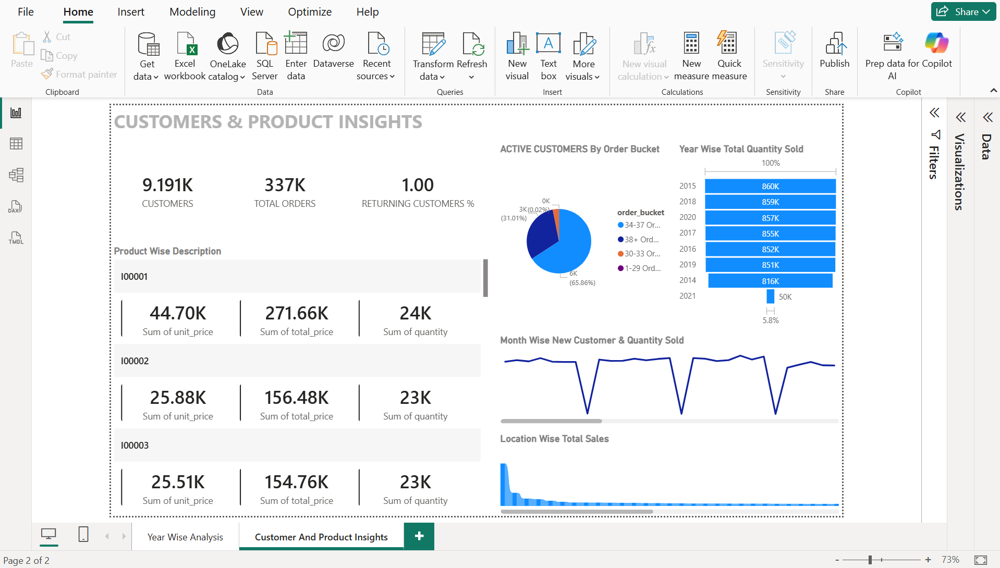

# 📊 E-Commerce Sales Analytics Dashboard

An end-to-end Business Intelligence project developed in Power BI to analyze e-commerce sales performance, customer behavior, product trends, and geographical sales distribution.

This project transforms raw transactional data into actionable business insights using Power Query, Data Modeling, DAX measures, and interactive dashboard design.

---

## 🚀 Project Highlights

✔ Built a complete end-to-end Power BI analytics solution

✔ Designed a Star Schema data model for scalable reporting

✔ Created advanced DAX measures for KPI tracking

✔ Developed interactive dashboards for business decision-making

✔ Analyzed customer purchasing behavior and retention patterns

✔ Visualized geographical sales performance using map-based reporting

✔ Applied data storytelling principles to present actionable insights

---

## 📌 Project Status

✅ Completed

---

## 📈 Business Questions Answered

### Sales Performance

- What is the overall revenue generated?
- How many products were sold?
- What is the average selling price?
- How is sales performance changing over time?

### Customer Analytics

- How many active customers exist?
- What percentage of customers return?
- Which customer segments generate the highest value?
- How are customer purchasing patterns evolving?

### Product Analytics

- Which products generate the highest revenue?
- Which products sell the highest quantity?
- What are the top-performing product categories?

### Location Analytics

- Which regions generate the highest revenue?
- How are sales distributed geographically?
- Which cities contribute most to overall sales?

---

## 📂 Dataset

The dashboard was developed using transactional e-commerce sales data containing customer, product, store, and time-related information.

> **Dataset Availability**
>
> Due to GitHub file size limitations, the original dataset is not included in this repository.
>
> The repository contains the Power BI dashboard, screenshots, and project documentation to showcase the analytical approach, data modeling process, and business insights generated from the dataset.

### Dataset Components

- Customer Information
- Product Information
- Sales Transactions
- Store Information
- Time Dimension

The dataset was transformed and modeled using Power Query and a Star Schema architecture to support efficient reporting and analysis.

---

## 🏗 Data Model

The dashboard follows a Star Schema architecture for optimized reporting performance.

### Fact Table

- Sales Transactions

### Dimension Tables

- Customer Dimension
- Product Dimension
- Store Dimension
- Time Dimension

This structure improves dashboard efficiency, scalability, and analytical flexibility.

---

# 📊 Dashboard Pages

## 1️⃣ Sales Performance Dashboard

Provides a high-level overview of business performance through KPI monitoring and trend analysis.

### Key Metrics

- Revenue
- Quantity Sold
- Average Unit Price
- Year-over-Year Growth

### Visualizations

- Revenue Trend Analysis
- Monthly Sales Trend
- Geographical Sales Distribution
- Top Product Performance

<p align="center">
  
</p>

---

## 2️⃣ Customer & Product Insights Dashboard

Provides deeper insights into customer behavior and product performance.

### Key Insights

- Customer Segmentation
- Returning Customer Analysis
- Product Performance Metrics
- Location-wise Sales Contribution

### Visualizations

- Customer Distribution Analysis
- Product Revenue Analysis
- Quantity Sold by Product
- Customer Order Bucket Segmentation

<p align="center">
  
</p>

---

## 🛠 Tools & Technologies

| Tool | Purpose |
|--------|----------|
| Power BI | Dashboard Development |
| Power Query | Data Transformation |
| DAX | Business Calculations |
| Excel / CSV | Data Source |
| Data Modeling | Star Schema Design |

---

## 💡 Skills Demonstrated

- Data Cleaning
- Data Transformation
- Data Modeling
- Star Schema Design
- Power Query
- DAX Measures
- KPI Design
- Business Intelligence
- Dashboard Development
- Customer Analytics
- Sales Analytics
- Data Visualization

---

## 📁 Repository Structure

```text
ecommerce-sales-analytics-dashboard
│
├── Screenshots
│   ├── year-wise-analysis.png
│   └── customer-product-insights.png
│
├── E-Commerce Dashboard.pbix
└── README.md
```

---

## 🎯 Key Learning Outcomes

Through this project, I strengthened my understanding of:

- End-to-End BI Project Development
- Business-Oriented Dashboard Design
- DAX Calculations and KPI Creation
- Customer and Product Analytics
- Data Modeling using Star Schema
- Interactive Reporting Best Practices
- Translating Business Requirements into Actionable Insights

---

## 👨‍💻 Author

### Mayank Jha

Aspiring Data Analyst | Power BI | SQL | Python | Data Visualization

🔗 [LinkedIn Profile](https://www.linkedin.com/in/mayank-jha-30801823b/)

🔗 [GitHub Profile](https://github.com/may7jha)
---

⭐ If you found this project interesting, feel free to explore the repository and share your feedback.